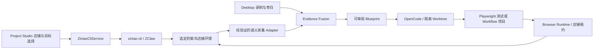

# 紫鸟浏览器接入设计与 CLI 核查

> 更新日期：2026-09-05。
> 实施范围：阶段 5 起。阶段 0–4 已完成，不追加验收项，也不要求重做。
> 本文是后续实现契约，不表示 FlowCode 已经支持紫鸟录制或运行。
> 产品设计见 [flowcode-design.md](flowcode-design.md)，执行顺序见 [flowcode-implementation-plan.md](flowcode-implementation-plan.md)。

## 1. 已核实的本机能力

本次检查安装包、二进制帮助、工具目录和只读店铺列表；未打开或关闭店铺、执行页面脚本、修改 CLI 配置、导出登录态或操作业务数据。

| 项目 | 2026-09-05 核查结果 | 对实现的约束 |
|---|---|---|
| npm 包与二进制版本 | `@ziniao-open/cli`、`ziniao-cli --version` 均为 `1.0.8` | 这是接入验证基线；后续升级需重新跑兼容性测试 |
| Windows 入口 | npm shim → `scripts/run.js` → `bin/ziniao-cli.exe` | Desktop 解析并校验真实二进制路径；使用命令数组和 `windowsHide: true`，不拼 Shell |
| 接口体系 | 服务端 OpenAPI 与本地 ZClaw Bridge | 首版仅使用店铺和页面所需的本地能力；不开放任意 ERP API |
| 店铺查询 | `store list --limit 1 --format json` 成功；顶层为 `ok/data`，`data` 含 `items/limit/page/total` | 校验分页；项目仅接收必要字段，不记录返回的 IP 等无关信息 |
| 店铺字段 | 本机列表项含 `storeId/storeName/platformName/ip` | 用返回的 `storeId` 精确绑定；名称仅用于展示和二次匹配，不推导数字 ID |
| 工具目录 | `zclaw tools --format json` 返回 `ok: true`、20 个工具名称及描述 | 目录不是参数 Schema，也不能单独证明每个工具在当前客户端可用 |
| 页面快照 | `page snapshot --help` 提供临时 ref、`--store-id/--target-id` | ref 只用于当前快照交互，不保存为长期 Blueprint Locator |
| 自动化 | `automation run --steps` 接收步骤 JSON | 这是执行接口，不是人工操作录制接口，也不替代 Playwright 项目 |
| 录制与 CDP | 已检查的帮助和工具目录未给出人工事件订阅接口、稳定 CDP 端点契约 | 阶段 5A 必须实测并作出接入决策，禁止臆造命令或返回字段 |
| 分发 | 本机 `package.json` 标记 `UNLICENSED`，安装含下载二进制的 `postinstall` | 首版检测用户已安装的 CLI；不默认再分发包或二进制，分发策略单独核实 |

本机 npm 包的 `README.md`、`package.json` 和 `scripts/run.js` 位于 `<global-npm-root>/@ziniao-open/cli/`。仓库文档不写入开发者用户名、真实店铺、API Key、代理、调试端口或页面地址。

## 2. 可使用的 CLI 契约

下表的参数来自本机 `1.0.8` 帮助；除第 1 节明确标记成功的调用外，其行为与响应仍需阶段 5A 的受控实测。以下是工具接口清单，不是应当立即执行的命令序列。

| 命令 | 已核实参数或行为 | FlowCode 用途 |
|---|---|---|
| `ziniao-cli --version` | 输出版本 | Doctor 与兼容性记录 |
| `ziniao-cli zclaw tools --format json` | 返回名称、描述及数量 | 初步能力探测 |
| `ziniao-cli store list` | `--keyword/--page/--limit/--all/--format/--jq` | 授权店铺选择器；分页加载 |
| `ziniao-cli store resolve` | `--id/--name/--expected-name/--format` | 精确解析；重名或不匹配时停止绑定 |
| `ziniao-cli store open` | `--id/--name/--expected-name/--url/--headless/--privacy/--window-ratio` | 打开用户选定环境；录制使用可见窗口，不默认改隐私模式 |
| `ziniao-cli store prepare-agent` | 帮助仅列 `--jq`，没有 `--store-id` | 有实测必要时再使用，不给它附加不存在的参数 |
| `ziniao-cli page extract` | `--mode store\|running\|plugin\|page`、`--store-id/--payload/--format` | 查询状态；具体数据层级以 Fixture 为准 |
| `ziniao-cli page snapshot` | 必需 `--store-id`；可选 `--target-id/--max-items/--timeout` | 运行诊断与局部定位辅助 |
| `ziniao-cli page exec` | 必需 `--store-id/--script`；可选 `--target-id/--timeout` | 仅 FlowCode 受控内部用途；不向模型开放任意脚本入口 |
| `ziniao-cli page upload` | `--file` 可重复；店铺、页面、控件及 `--confirmation-token` 等参数 | 文件选择映射和上传权限适配，不绕过紫鸟自身确认 |
| `ziniao-cli automation run` | 必需 `--steps`，可选 `--jq` | 不作为首版生成项目的默认执行格式 |
| `ziniao-cli zclaw invoke <tool>` | `--args` JSON | 服务内部白名单调用；不暴露任意工具名给模型或 Renderer |

执行服务要求：

- 优先调用已解析的 `ziniao-cli.exe`；不依赖交互终端 PATH，也不通过 npm shim 打开可见辅助窗口。
- 验证退出码、顶层 `ok`、具体命令的业务状态和响应 Schema；不能假定全部命令都采用 `data.data`。
- `zclaw tools` 中 `open_store` 的描述提及 `kernelDownloading`、`zclawLaunchHint` 和可能的 `downloadFolderPath`。这些是待实测响应能力；内核准备应显示独立进度并支持取消，不能使用页面点击的短超时。
- 超时或取消 CLI 子进程，不代表店铺端操作已经取消。先查询实际状态，再决定后续动作；提交、上传和下载不得盲目重发。
- CLI 凭据由已安装 CLI 的凭据机制管理。FlowCode 只保存非敏感配置引用；Doctor 不输出 `config show` 原文，也不把 API Key 放入参数、Prompt、Git 或日志。
- `config use` 会切换当前配置。首版不自动切换多个 CLI 账号；绑定时记录账号引用，运行前复核，发现外部切换后要求重新绑定。以后支持并行账号前必须证明配置隔离。

## 3. 调用、录制与运行分层

`BrowserRuntimeProvider` 是浏览器环境适配接口；OpenCode 仍是唯一 Coding Harness。紫鸟负责店铺环境、代理、指纹和登录态，FlowCode 负责证据、项目代码、运行授权、结果和审阅。

### 3.1 录制路径：阶段 5A 决策，5B 实现

CLI 页面快照或截图轮询不能替代人工事件采集。必须验证一条能接收真实操作、跨导航持续工作且能安全 Flush 的路径：

1. **优先验证复用语义扩展**：确认紫鸟客户端/内核支持加载 FlowCode 扩展、站点权限、Native Messaging 与精确扩展 ID。验证通过后使用专门的紫鸟 Source 和注册配置；不得冒充 Chrome 或修改 Chrome/Edge 已有注册项。
2. **扩展链路不具备条件时验证 CDP 采集 Adapter**：从受支持的紫鸟接口或明确版本绑定的本地发现机制获取端点，并核实其所属店铺。复用 Locator、输入防抖和隐私逻辑，在隔离执行上下文中采集真实事件，向 Desktop 输出统一事件。端点获取、上下文验证和跨导航重注入均需专项测试。
3. 阶段 5A 的 ADR 选择一条首版生产路径，不要求同时维护两套紫鸟采集实现。另一条保留为调查结论。

不得硬编码调试端口、通过店铺名称猜测进程、扫描任意本机 CDP 服务后选第一个，或把“Chromium 内核”当成 Native Messaging/CDP 完整兼容的证据。若临时通过进程信息诊断端点，只用于证明可行性；成为生产实现前必须有明确版本约束、精确身份验证和失败处理。

两条路径均须覆盖：

- Desktop 总控 Start/Stop/Discard，绑定 `sessionId/sourceId`、来源时钟、递增序号、去重和有界缓冲。
- 只记录选定店铺、选定页面及用户允许的关联 Popup；其他店铺与无关标签页不能混入。
- `click/fill/select/check/submit/navigate/tab/popup/upload/download`；已授权 iframe、开放 Shadow DOM 和 SPA 导航。
- 真实人工动作与 FlowCode 自动执行动作区分来源；页面 `postMessage`、可见全局变量或任意 binding 调用不能成为可信事件依据。
- 停止等待 Flush；断线、页面被关闭、导航期间无法采集时生成 Gap，不静默宣布完整。
- 每次会话只有一个语义采集通道，避免扩展与 CDP 对同一动作重复记录。
- CLI 的临时 ref、CDP target ID 和原始 browser tab ID 映射为会话页面引用；长期代码保存稳定 Locator 和 frame 定位链。

CDP 在此可仅作为 Standard 语义采集的连接通道。获得 CDP 连接不等于允许读取网络正文、完整 DOM、Cookie 或登录态；深度证据仍按阶段 8 单独开启。

### 3.2 店铺绑定与浏览器租约

阶段 5A 定义并版本化以下契约，阶段 5B/6A 分别实现采集端与运行端：

- `BrowserEnvironmentProfile`：provider、非敏感账号引用、精确店铺绑定、站点允许范围、浏览器显示模式、登录方式和能力快照。存放在本机，不把账号、代理或店铺绑定写进通用模板。
- `BrowserSessionLease`：项目/录制或 Run、environment ID、店铺身份、页面范围、启动归属、有效期和释放状态。调试端点保留在受控进程中，不进入模型上下文或导出包。
- `BrowserCapabilities`：采集传输、事件类型、iframe/Popup/上传/下载、Playwright 连接、Trace 等逐项结果和对应版本。`unsupported/unknown` 都不能显示为已支持。

默认一次录制绑定一个店铺；同一店铺只允许一个 FlowCode 录制或执行租约。恢复前重新核对店铺、页面、登录状态和租约；禁止自动切到名称相似的店铺。

### 3.3 生成和运行项目：阶段 6

- 保留 `web-test`、`browser-automation` 两种项目类型，通过运行环境选择紫鸟，不新建第二套项目产品。
- 阶段 6A 模板提供统一的 Browser Runtime/Fixture 入口。普通 Chrome/Edge 使用现有启动模式；紫鸟由 Desktop 解析店铺租约，运行适配器连接已验证的浏览器环境。
- 优先验证 Playwright `connectOverCDP` 与该紫鸟内核的兼容性。复用已授权环境的有效上下文，不调用普通 `chromium.launch()` 创建空白浏览器来假装复用了店铺登录态。
- 代码使用逻辑页面引用、稳定 Locator 和参数，不硬编码 `storeId`、端口、账号、临时 ref 或本机绝对路径。
- CLI 的页面控制不能被宣称等价于 Playwright；CDP/Fixture 验证失败时标记当前版本不支持对应项目运行，不静默降级成 `automation run`。
- 借用用户已打开的浏览器，结束时只释放本次连接和本次创建的资源。不要在通用 `finally` 中调用 `store close` 或关闭用户原有标签页；FlowCode 打开的店铺也默认保留，按明确的运行设置决定是否关闭。
- 上传参数映射为经用户选择的文件引用；下载先使用已验证的店铺允许目录，再通过受控产物导入复制到 Run 目录。文件扩展名、完成状态、类型和路径都要校验。
- 本地 Fixture/测试店铺用于 Builder 自动验证。真实店铺的业务写操作在代码审阅后由用户发起，运行页展示目标店铺、输入和操作范围。

## 4. 电商工作流能力

| 能力 | 最早交付阶段 | 范围 |
|---|---|---|
| 生成前体检 | 5C | Gap、缺失 Locator/页面上下文、参数、人工步骤、未确认断言与浏览器能力不匹配 |
| 步骤整理 | 5C | 删除误操作、合并重复输入、固定值/参数选择、标记人工步骤；原始证据不变 |
| 登录与人工接管 | 6A | 专用浏览器手工登录、MFA/验证码交给用户；恢复前复核店铺和页面 |
| 数据提取与变量传递 | 6B | 订单号、商品信息等页面结果绑定后续输入；输出 JSON/CSV 和文件产物 |
| 提交确认与恢复 | 6B | 发布、改价、库存、发货等业务写步骤有影响摘要、确认点和结果核对；无法判断结果时进入人工核对 |
| 失败步骤局部补录 | 7A | 原目标内替换失败步骤范围，保留人工代码和已确认断言，展示 Patch/Diff |
| 多组数据运行 | 7B | JSON/CSV 输入校验、逐行状态、逐行产物、失败后续跑；首版固定一个店铺绑定 |
| 多店铺队列 | 7B | 用户显式选择店铺与数据映射后串行执行；逐店复核、锁和结果隔离，禁止隐式遍历所有店铺 |

重试策略区分读取、可重复写入与不可确定结果的提交。需要结合业务唯一键、已完成检查或人工确认决定能否重试；不能把 Git 回滚当作撤销订单、商品发布或库存变化。

## 5. 安全边界和验收证据

- OpenCode 权限与 Git Worktree 不构成操作系统沙箱。文件/进程/网络隔离必须由阶段 5A 确定并实测；紫鸟凭据和原始 Session 不提供给生成代码或模型。
- 控制 CLI 的特权服务只执行明确的店铺/页面白名单操作，不给模型任意 `api`、`zclaw invoke`、`page exec`、配置切换或关闭店铺能力。
- 直接授予 Playwright 原始 CDP 端点意味着获得该浏览器环境的广泛控制能力，不能再声称只有单个 Selector 权限。生产连接仅用于已审阅代码和用户明确选定的店铺；自动生成验证优先使用本地 Fixture/测试环境。若实现更细权限的浏览器代理，必须单独验证其边界。
- 登录态留在紫鸟环境内；复用授权环境与导出 `storageState` 是不同授权。默认不复制用户配置目录、导出 Cookie、改变代理或指纹配置。
- 本地保存店铺 ID、API 配置引用、CLI/客户端/内核版本；面向模型的证据使用别名和必要上下文。授权、日志和 Fixture 中不含真实账号数据。

阶段验收必须保留：固定版本 CLI 的帮助摘要与响应 Schema Fixture、选定采集路径 ADR、Chrome/Edge 回归结果、紫鸟人工操作录制 E2E、紫鸟项目连接及产物能力结果。至少包含重名店铺、错误店铺、账号切换、内核准备、断线 Flush、Popup/iframe、上传下载、失效登录态、人工暂停恢复和有副作用步骤的重复执行保护。

只读 CLI 核查成功不等于上述 E2E 成功。未通过的浏览器版本/功能写入能力矩阵并显示明确状态；不能为通过阶段验收删除用户要求的紫鸟录制和项目运行目标。

## 6. 来源与后续复核

- 本机 `@ziniao-open/cli@1.0.8` 的 `package.json`、`README.md`、`scripts/run.js` 与本文列出的 `--help` 输出。
- 本次成功调用：`--version`、`zclaw tools --format json`、`store list --limit 1 --format json`。仅保留版本、字段名和状态，不保存真实店铺响应。
- [紫鸟官方 Skills 仓库](https://github.com/ziniao-open/skills)：提供接口使用背景。其公开说明与本机命令可能存在差异，具体参数以固定版本的帮助和契约测试为准，不把其中的初始化或配置修改示例作为自动执行指令。
- [Playwright CDP 连接](https://playwright.dev/docs/api/class-browsertype#browser-type-connect-over-cdp)：CDP 连接与 Playwright 原生连接的能力不同，必须按紫鸟内核验证。
- [OpenCode 安全边界](https://github.com/anomalyco/opencode/blob/dev/SECURITY.md)与[配置合并规则](https://opencode.ai/docs/config/)：用于阶段 5A 的实际隔离方案和加载面核查。
